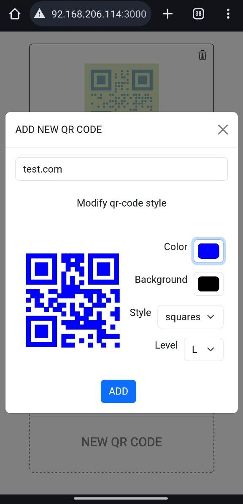
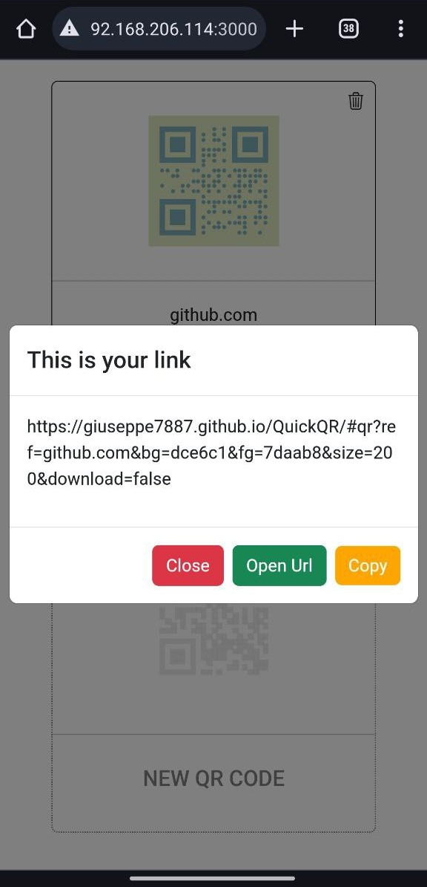
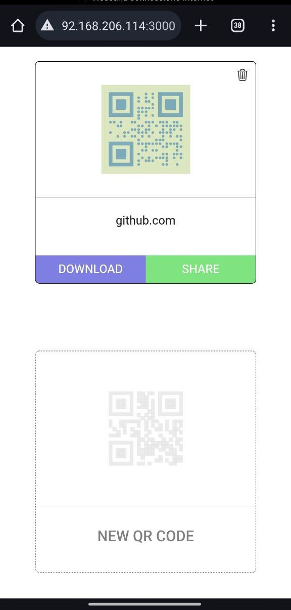
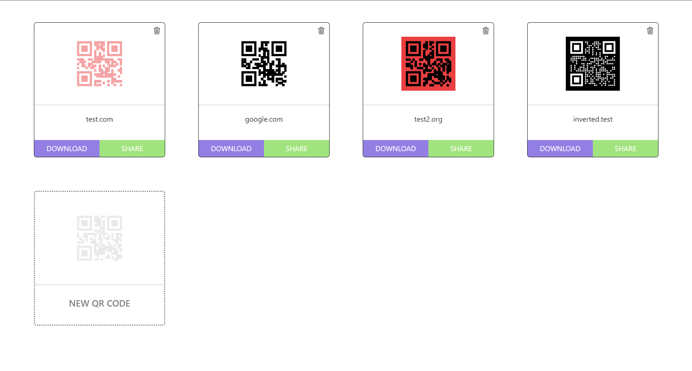
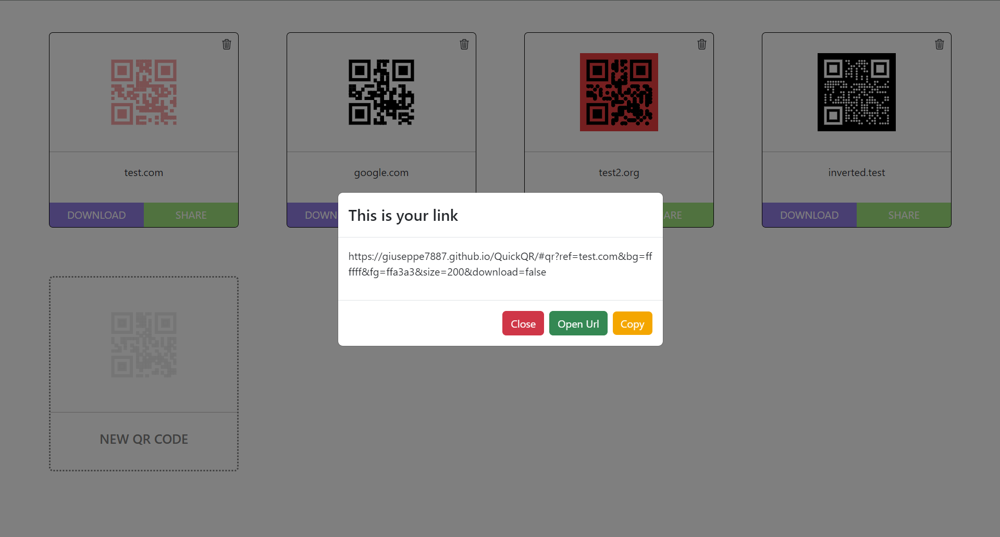
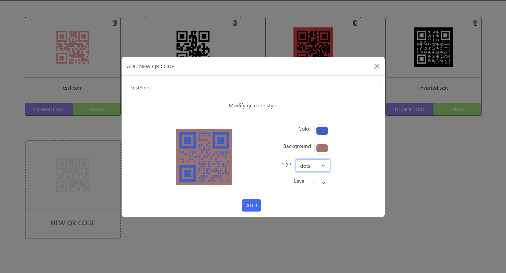

# FREE QR CODE GENERATOR 🍀

### ```Use this tool to create,customize, share and download fantastic QR codes 🌈``` 

<br/>

## QUICK START 🏎️

## 1 create QR codes at https://giuseppe7887.github.io/QuickQR/
```In this section you can create, customize and download QR codes```


## 2 SHARE QR https://giuseppe7887.github.io/QuickQR/#qr?ref=google.com

### URL PARAMS

| param | type | example | description | default | required |
| -------------- | -------------- | -------------- | -------------- |  --------------  |   --------------  |
| ref | String | google.con | link (QR code value) | null | true |
| size | Number | 250 | QR code size | 300 | false |
| bg | hex | fb6737 | background color | FFFFFF | false |
| fg | hex | 00fe37 | foreground color | 000000 | false |
| download | bool | true | auto download png | false | false |
| style | String | dots | qr code style | squares | false |

- *Possible value for style: dots, squares and fluid*


### FULL LINK EXAMPLE

https://giuseppe7887.github.io/QuickQR/#qr?ref=google.com&size=300&bg=344830&fg=f8983b&style=dots&download=false


# MOBILE SCREENS





<br/>

# DESKTOP SCREENS



<br/>



<br/>


